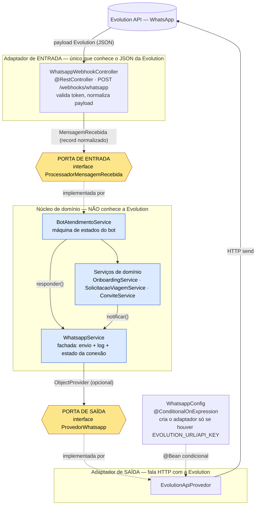
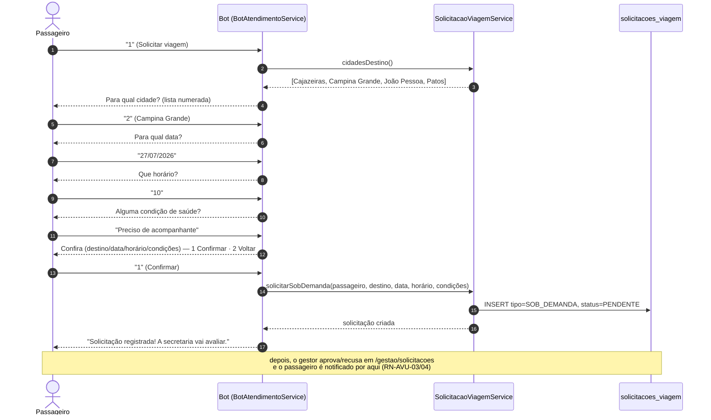
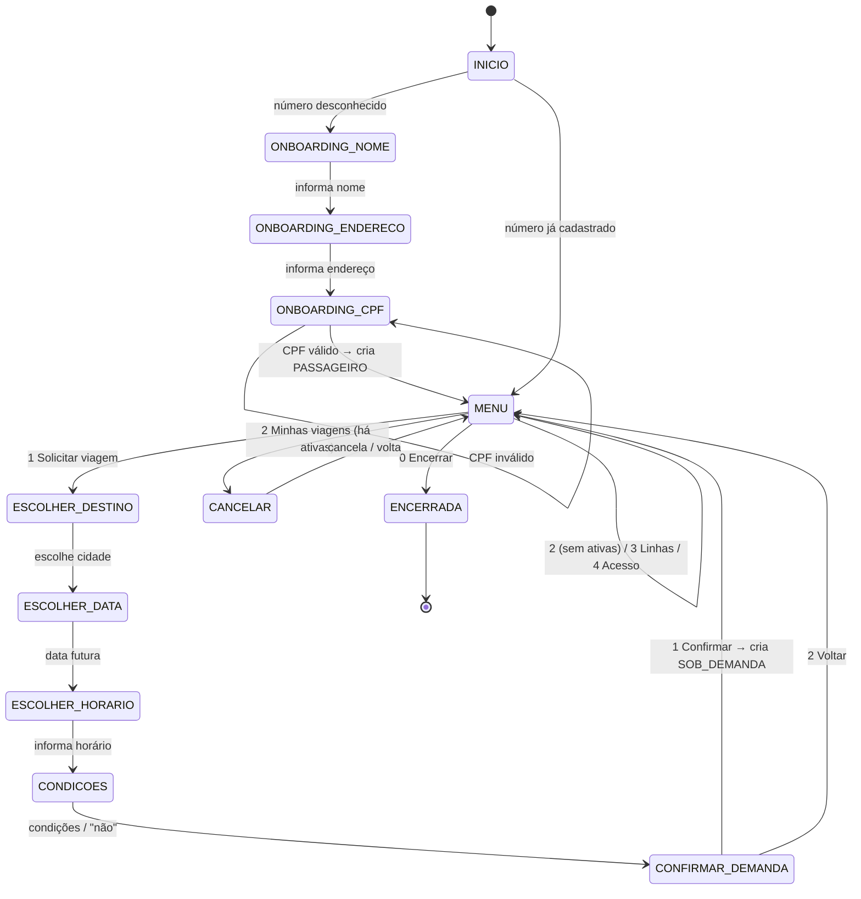
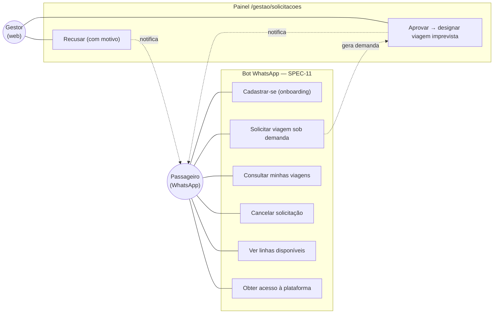

# SPEC-11 — Solicitação de transporte sob demanda e onboarding do passageiro por WhatsApp

| | |
|---|---|
| **Área** | `AVU` (solicitação avulsa/sob demanda) + `ONB` (onboarding do passageiro) |
| **Papéis** | PASSAGEIRO (solicita pelo WhatsApp, **sem login**); GERENTE (avalia, aprova/recusa, designa) |
| **Status geral** | ✅ **Implementada (2026-07-15)** — migration **V13**, testes verdes, build CI ok. Bot desacoplado (só porta `ProvedorWhatsapp` + serviços). Decisões D1–D5 em §4. **Atualização 2026-07-16**: opção de menu **"3 Linhas disponíveis"** (§4 D5) + **diagramas de arquitetura/fluxo para apresentação (§13)**. **Pendente**: infra da Evolution/VPS (como na SPEC-10) |
| **Código** | `TipoSolicitacao`, evolução de `SolicitacaoViagem`/`SolicitacaoViagemService` (`solicitarSobDemanda`/`aprovar`/`recusar`), `OnboardingService`, `ConviteService#gerarAcessoPlataforma`, `BotAtendimentoService`+`MensagensBot` (reescritos), `GestaoSolicitacaoController` + `gestao/*.html` |
| **Constituição** | Artigos II (camadas), IV (migrations forward-only), VI (UUID/enums VARCHAR), VII (RBAC), VIII (telefone canônico / senha opcional), X (HTMX/Thymeleaf) |
| **Relacionada** | [SPEC-09](SPEC-09-solicitacao-de-transporte.md) (contraparte por **linha programada**; realiza a **RN-SOL-08**), [SPEC-10](SPEC-10-integracao-whatsapp.md) (bot; **altera RN-WPP-05** e a exclusão §3.2), [SPEC-06](SPEC-06-viagens-rotineiras-e-imprevistas.md) (viagem **IMPREVISTA**), [SPEC-07](SPEC-07-endereco-do-passageiro.md) (endereço de embarque), [SPEC-01](SPEC-01-autenticacao.md) (RBAC) · **ADR-15** (proposta, §4) |

---

## 1. A lacuna que esta spec cobre

A SPEC-09 entregou a solicitação **ancorada numa linha programada**: o passageiro escolhe, num
calendário, uma das linhas que o gerente **já cadastrou** e que operam naquele dia da semana. Esse
modelo funciona bem numa tela web, mas **não encaixa** no uso real por WhatsApp nem na regra de
negócio do dono do projeto:

1. **Login não deveria ser pré-requisito.** O passageiro do transporte municipal de saúde é, em
   geral, alguém que **não vai acessar um sistema web** — ele fala pelo WhatsApp. Hoje o bot
   **rejeita número desconhecido** (SPEC-10, RN-WPP-05) e manda procurar a secretaria. Isso trava a
   função-fim: quem mais precisa do serviço fica de fora até um gerente cadastrá-lo manualmente.

2. **A demanda é avulsa, não uma linha fixa.** No mundo real o pedido é *"preciso ir a João Pessoa
   no dia 20/07 para uma consulta às 14h"* — uma **demanda sob demanda**, que pode exigir **veículo
   acessível (PCD)**, **ambulância** ou **acompanhante**, e que **não corresponde** a nenhuma linha
   pré-programada. Forçar o passageiro a escolher de uma lista fixa de linhas é artificial no chat.

Esta spec resolve as duas coisas: **auto-cadastro (onboarding) do passageiro pelo WhatsApp** e a
**solicitação sob demanda** (a "solicitação específica" prevista, e adiada, na **RN-SOL-08** da
SPEC-09). O modelo de **linha programada** da SPEC-09 **continua válido** e coexiste — esta spec
**não o substitui** (ver §3.3 e §11).

---

## 2. O que muda em relação ao que já existe

| Decisão anterior | Onde | O que muda nesta spec |
|---|---|---|
| Número desconhecido é **rejeitado**, sem criar cadastro | SPEC-10 RN-WPP-05 / §4.5 | Passa a **oferecer o auto-cadastro** guiado pelo bot; só cria conta com o consentimento e os dados mínimos (RN-ONB-01..03) |
| **Auto-cadastro por WhatsApp** listado como "não inclui" | SPEC-10 §3.2 | Passa a **estar no escopo** (esta spec) |
| Solicitação **exige** uma `linha_programada` (FK NOT NULL) | SPEC-09 V11 / RN-SOL-01 | Passa a existir a solicitação **sem linha** (sob demanda), com **destino + data + requisitos** próprios — RN-SOL-08 realizada |
| Alocação **deriva** da designação da viagem da linha | SPEC-09 RN-SOL-05 | Solicitação sob demanda **não tem linha**: exige **avaliação do gerente** (aprovar → designar viagem **IMPREVISTA** → alocar; ou **recusar**) |

Nada disso quebra a SPEC-09/10 já implementada: a tela web por linha e o fluxo de bot por linha
seguem funcionando; esta spec **adiciona** um segundo caminho.

---

## 3. Escopo

> **Os dois cenários de entrada** (decisão do dono do projeto). Em **ambos**, o telefone do
> remetente **já é a verificação de identidade** — não há camada extra de confirmação por ora:
>
> 1. **Número já cadastrado** — o bot reconhece o telefone na tabela `usuarios` e cai direto no
>    **menu** (§6): *Solicitar viagem*, *Minhas viagens*, *Acesso à plataforma*, …
> 2. **Número ainda não cadastrado** — o bot **guia o cadastro** (dados mínimos para viajar) e, ao
>    fim, entrega o **mesmo menu** do cenário 1. Como o número já vem verificado pelo WhatsApp, o
>    cadastro não pede verificação adicional.

### 3.1 Inclui — Onboarding (`ONB`)
- No primeiro contato de um **número desconhecido**, o bot **guia o cadastro** (em vez de recusar).
- Coleta guiada dos **dados mínimos para viajar** (D3): **nome completo**, **endereço de embarque**
  (onde o motorista busca — SPEC-07) e **CPF**.
- Cria um `Usuario` **PASSAGEIRO** **ATIVO sem senha** (telefone é o identificador — Art. VIII).
  Ele **opera pelo WhatsApp**; para **entrar na plataforma web** usa a opção **"Acesso à
  plataforma"** do menu, que dispara o fluxo de definição de senha (§3.3).
- O gerente vê e completa/edita esse cadastro nas telas de usuário já existentes (SPEC-02).

### 3.2 Inclui — Solicitação sob demanda (`AVU`)
- Fluxo do bot para **pedir transporte sem linha**: **destino** (cidade cadastrada — D4),
  **data** e **horário** desejados, e **condições de viagem** (comorbidade/deficiência) que
  informam a **avaliação de prioridade** pelo gestor.
- A solicitação nasce **PENDENTE de avaliação** (não há linha para alocar automaticamente).
- **Painel do gerente** para as solicitações sob demanda: listar pendentes (com as condições, para
  avaliar prioridade), **aprovar** (designa uma viagem **IMPREVISTA** — SPEC-06 — com veículo
  **adequado** e aloca o passageiro) ou **recusar** (com motivo). Usa, enfim, o status `RECUSADA`.
- **Notificação do resultado** ao passageiro pelo canal WhatsApp — **só após a aprovação/recusa do
  gestor** é que o passageiro é avisado. Reusa o `NotificacaoService`/canal da SPEC-10.
- Consulta ("Minhas viagens") e cancelamento pelo próprio passageiro (bot), com o **isolamento** da
  RN-SOL-07.

> **Painel `/whatsapp` — "Configurações de envio" (2026-07-16):** o painel do gerente ganhou um card
> de configurações persistidas (via `ConfiguracaoService`): **nome de exibição** (assinatura das
> mensagens), **modelo da mensagem de confirmação** (`{data}`/`{hora}`/`{destino}` — usado de fato na
> notificação de aprovação, RN-AVU-03) e **horário de atendimento**. ⚠️ O horário de atendimento é
> **persistido mas ainda não é aplicado** para silenciar o bot fora da janela (fica para depois — não
> gatilhar isso agora evita o bot ficar mudo durante os testes). O card "Canais de mensagem" é um
> placeholder **"Em breve"**.

### 3.3 Inclui — "Acesso à plataforma" (ponte WhatsApp → web)
- Opção do menu que permite ao usuário **só-WhatsApp** obter **acesso web**: o bot **reaproveita o
  fluxo de token de ativação** já existente (convite/token — ADR-11, SPEC-01) e envia um **link**
  para o usuário **definir a senha**. A partir daí ele passa a **logar** (telefone/e-mail + senha).
- Não cria mecanismo novo de segurança: é o mesmo `TokenAtivacao`/`NotificacaoService` já em uso.

### 3.5 Inclui — "Linhas disponíveis" (informativo — 2026-07-16)
- Opção **3** do menu que **lista as linhas rotineiras ativas** (origem→destino, dias da semana e
  horário de saída) para o passageiro saber **o que a secretaria já opera**. Reusa o mesmo dado da aba
  "Linhas disponíveis" da web (SPEC-09) — `SolicitacaoViagemService#linhasDisponiveis()`.
- É **puramente informativo**: não inicia um pedido nem altera o estado da conversa (o bot volta a
  exibir o menu, permanecendo em `MENU`). O pedido continua sendo **sob demanda** (opção 1) — não há
  "solicitar por linha" pelo bot.

### 3.4 Não inclui (futuro)
- **Assentos/capacidade** (`assentos_viagem`) e o encadeamento acompanhante↔titular — continua fora
  (como na SPEC-09 §2.2); a aprovação aqui **aloca** o passageiro à viagem, sem controle fino de lotação.
- **Alocação automática por prioridade** — o gestor **avalia** a prioridade a partir das condições e
  decide manualmente; o cálculo/ordenação automática fica para depois (retoma o antigo "Incremento B").
- **Integração com o WhatsApp dos motoristas** (avisar o motorista da viagem pelo chat) — **próxima
  etapa** após esta spec.
- **Auto-cadastro pela web** (o onboarding desta spec é **só** pelo WhatsApp; pela web o cadastro
  segue sendo do gerente — SPEC-02).
- **Roteirização** de embarque a partir do endereço estruturado (só se **registra** o local).
- Alteração do fluxo **por linha** da SPEC-09 (permanece intacto).

---

## 4. Decisões de modelo (tomadas) — base da **ADR-15**

> Decididas com o dono do projeto (2026-07-15). Restou aberta apenas a **D5** (menu do bot).

### D1 — Onde mora a solicitação sob demanda? → **✅ Opção A: estender `solicitacoes_viagem`**
Tornar `linha_programada` **nullable** e acrescentar as colunas da demanda; um `tipo`
(`POR_LINHA` \| `SOB_DEMANDA`) distingue os dois. **Uma** fila unificada para o gestor, **um**
serviço/ciclo de status, reuso do `SolicitacaoViagemService`, `StatusSolicitacao`, isolamento e o
bot da SPEC-10. A tabela dormente `solicitacoes_transporte` (V2) fica formalmente **aposentada**
(registrar DT de limpeza). Custo aceito: colunas opcionais por tipo, resolvidas com **`CHECK`
condicional** (linha ⊕ destino) — ver §5.

### D2 — Estado da conta auto-cadastrada → **✅ Nasce `ATIVO`, sem senha**
Pelo WhatsApp o número **já é a autenticação**, então a conta é **ATIVA** desde o cadastro; ela só
**não entra na plataforma web** (não tem senha). O upgrade para acesso web é o passo **"Acesso à
plataforma"** do menu (§3.3), que define a senha via token. Seguro perante o Art. VIII: sem
credencial, não há login — a conta ativa serve **só** para o bot identificar o usuário.

### D3 — O que o bot pergunta no cadastro → **✅ Nome, endereço, CPF**
Dados mínimos para viabilizar a viagem: **nome completo**, **endereço de embarque** (onde o
motorista busca) e **CPF**. Os dados do **pedido** (data, horário, destino) são coletados no fluxo
de solicitação, não no cadastro. O endereço reaproveita a estrutura da SPEC-07 (no mínimo
logradouro/número/bairro/ponto de referência).

### D4 — Destino → **✅ Escolher entre as cidades já cadastradas**
O bot lista as **cidades cadastradas** (numeradas) e o usuário escolhe — evita texto livre ambíguo
e já casa com a frota/viagem imprevista. (Base: cidades METROPOLITANAS de destino.)

### D5 — Menu do bot → **✅ Definido**
**1** Solicitar viagem · **2** Minhas viagens · **3** Linhas disponíveis · **4** Acesso à plataforma ·
**0** Encerrar. (A opção "falar com a gestão" da SPEC-10 sai do menu; a etapa `HUMANO` permanece no
schema/código, dormente, para uso futuro.)

> **Atualização 2026-07-16 — opção "3 Linhas disponíveis".** A pedido do dono do projeto, o menu ganhou
> uma opção **informativa** que lista as **linhas rotineiras ativas** (rotas que a secretaria já opera,
> com dias e horário de saída — reusa `SolicitacaoViagemService#linhasDisponiveis()`, o mesmo dado da
> aba web da SPEC-09). É **só leitura**: não muda o estado da conversa (permanece no `MENU`) e o pedido
> em si continua **sob demanda** (opção 1). "Acesso à plataforma" passou de **3** para **4**. Ver
> RN-AVU-09 (§7) e os diagramas de apresentação em **§13**.

---

## 5. Modelagem (migration V13 — D1 = A)

Evolução **aditiva** (Art. IV) de `solicitacoes_viagem`:

```
ALTER solicitacoes_viagem:
  linha_programada       UUID NULL          -- deixa de ser NOT NULL (demanda não tem linha)
  tipo                   VARCHAR(20) NOT NULL DEFAULT 'POR_LINHA'
                         CHECK (tipo IN ('POR_LINHA','SOB_DEMANDA'))
  cidade_destino         UUID REFERENCES cidades(id)   -- obrigatória se SOB_DEMANDA
  horario_desejado       TIME                          -- horário desejado da viagem/consulta
  condicoes              VARCHAR(280)                  -- comorbidade/deficiência (avaliar prioridade)
  motivo_recusa          VARCHAR(280)                  -- preenchido ao RECUSAR

  -- data_desejada já existe (V11) e serve para os dois tipos.
  CHECK ( (tipo='POR_LINHA'   AND linha_programada IS NOT NULL)
       OR (tipo='SOB_DEMANDA' AND cidade_destino  IS NOT NULL) )
```

- `StatusSolicitacao` **já cobre** o ciclo: `PENDENTE → ALOCADA | RECUSADA | CANCELADA`. Para a
  demanda, `PENDENTE` = aguardando **avaliação** do gerente (não designação automática).
- **Prioridade** não é campo próprio nesta etapa: o gestor a **avalia** lendo `condicoes` ao decidir.
  Um campo/ordenação formal de prioridade fica para o "Incremento B" futuro (§3.4).
- Onboarding **não cria tabela nova**: usa `usuarios` (**ATIVO, `hash_senha` NULL** — D2) + o
  `endereco` da SPEC-07 (embarque). "Acesso à plataforma" reusa `tokens_ativacao` (ADR-11).
- `TipoSolicitacao` (`POR_LINHA`/`SOB_DEMANDA`) como VARCHAR (Art. VI). Sem extensões (Art. XIV).

**Código previsto:** evolução de `SolicitacaoViagem`/`SolicitacaoViagemService`
(`solicitarSobDemanda`, `aprovar`, `recusar`); `OnboardingService` (cria o passageiro pelo bot e
gera o token de "Acesso à plataforma"); novas etapas no `BotAtendimentoService` (cadastro + pedido
sob demanda + menu); painel do gerente `GestaoSolicitacaoController` + telas HTMX; migration **V13**.

---

## 6. Fluxo do bot (SPEC-10 estendida) — os dois cenários

```
Mensagem recebida ─► identifica pelo telefone (usuarios)
│
├─ CENÁRIO 2: número NÃO cadastrado ─► onboarding (dados mínimos p/ viajar)
│     NOME ─► ENDERECO(embarque) ─► CPF ─► cria PASSAGEIRO (ATIVO, sem senha) ─┐
│                                                                              │
└─ CENÁRIO 1: número já cadastrado ───────────────────────────────────────────┤
                                                                               ▼
                                                                          ┌── MENU ──┐  (D5)
                                                                          │ 1 Solicitar viagem
                                                                          │ 2 Minhas viagens
                                                                          │ 3 Linhas disponíveis
                                                                          │ 4 Acesso à plataforma
                                                                          │ 0 Encerrar
                                                                          └──────────┘
   1 Solicitar viagem:
        DESTINO(lista de cidades) ─► DATA ─► HORARIO ─► CONDIÇÕES(comorbidade/deficiência?)
        ─► CONFIRMAR ─► cria solicitação SOB_DEMANDA (PENDENTE de avaliação)
        ─► "Recebido! A secretaria vai avaliar e você recebe a resposta por aqui."
   2 Minhas viagens: lista as próprias solicitações + status (isolamento)
   3 Linhas disponíveis: lista as linhas rotineiras ativas (informativo) e volta ao menu
   4 Acesso à plataforma: gera token e envia link para definir senha (§3.3)
```

- O passageiro **só é notificado do resultado após o gestor aprovar/recusar** (não há confirmação
  automática de viagem).
- Máquina de estados persistida em `conversas_bot` (SPEC-10) ganha as novas etapas (novos valores de
  `EtapaConversa` + contexto de cadastro/pedido). Textos centralizados em `MensagensBot`.
- Aprovação/recusa pelo gerente **dispara notificação WhatsApp** ao passageiro (canal da SPEC-10).

---

## 7. Regras de negócio

| Regra | Descrição |
|---|---|
| **RN-ONB-01** | Número desconhecido é **guiado ao cadastro** (não recusado); coleta os dados mínimos (D3): **nome, endereço, CPF**. |
| **RN-ONB-02** | Conta criada pelo bot é **PASSAGEIRO ATIVO sem senha** (D2); não autentica na web até definir senha; telefone único entre ativos (Art. III). |
| **RN-ONB-03** | Reingresso: número **já cadastrado** nunca recria conta; cai direto no menu (idempotência do onboarding). |
| **RN-ONB-04** | **"Acesso à plataforma"** gera um **token de ativação** (ADR-11) e envia o link para o usuário definir a senha; a partir daí ele loga (telefone/e-mail + senha). |
| **RN-AVU-01** | Solicitação sob demanda exige **destino (cidade cadastrada) + data futura + horário**; **condições** (comorbidade/deficiência) são opcionais. |
| **RN-AVU-02** | Nasce **PENDENTE de avaliação**; **não** há alocação automática (não tem linha). |
| **RN-AVU-03** | **Aprovar** exige designar/associar uma viagem **IMPREVISTA** (SPEC-06) com **veículo adequado** (acessível/`AMBULANCIA` conforme as condições) → status `ALOCADA` + notifica. |
| **RN-AVU-04** | **Recusar** exige **motivo**; status `RECUSADA` + notifica o passageiro. |
| **RN-AVU-05** | O passageiro **só é notificado após a decisão do gestor** (aprovação/recusa) — não há aviso automático na criação além do "recebido". |
| **RN-AVU-06** | **Isolamento** (herda RN-SOL-07): o passageiro só vê/cancela as próprias solicitações, pelo bot; o gerente vê todas. |
| **RN-AVU-07** | **Sem duplicata** de solicitação ativa para o mesmo destino+data (índice/validação, análogo à RN-SOL-04). |
| **RN-AVU-08** | Envio de notificação nunca derruba o fluxo (herda RN-WPP-01); in-app permanece como redundância. |
| **RN-AVU-09** | **"Linhas disponíveis"** é **informativa**: lista as linhas **ativas** (`ativa = true`), não altera o estado da conversa (permanece em `MENU`) e não cria solicitação. Sem linhas ativas, avisa e mantém o menu. |

---

## 8. RBAC e rotas (proposta)

- Bot: sem rota web (entra pelo webhook da SPEC-10).
- Painel do gerente sob `/solicitacoes/gestao/**` (ou `/gestao/solicitacoes`) exige **GERENTE**
  (Art. VII); padrão HTMX (Art. X). O passageiro **não ganha rota web nova** (ele usa o bot).

| Método | Rota (proposta) | Acesso | Ação |
|---|---|---|---|
| GET | `/solicitacoes/gestao` | GERENTE | Lista solicitações **sob demanda** (filtra PENDENTE) |
| POST | `/solicitacoes/gestao/{id}/aprovar` | GERENTE | Designa viagem imprevista + aloca + notifica |
| POST | `/solicitacoes/gestao/{id}/recusar` | GERENTE | Recusa com motivo + notifica |

---

## 9. Testes (previsto)

- **Onboarding** (`BotAtendimentoServiceTest`): número desconhecido → cadastro guiado cria PASSAGEIRO
  sem senha; reingresso não duplica (RN-ONB-03); recusa a cadastrar encerra educadamente.
- **Solicitação sob demanda** (serviço): cria PENDENTE sem linha; validações (destino/data/duplicata);
  aprovar exige veículo compatível (PCD/ambulância) e aloca; recusar exige motivo; isolamento.
- **Painel do gerente** (MockMvc + Testcontainers): RBAC (GERENTE 200; demais 403); aprovar/recusar
  refletem status e disparam notificação (mock do canal).
- **Contexto** (Testcontainers): schema **V1→V13** válido.

---

## 10. Impacto em specs/documentos existentes

- **SPEC-09**: marcar **RN-SOL-08** como **realizada por SPEC-11**.
- **SPEC-10**: **RN-WPP-05** deixa de "rejeitar" e passa a "oferecer cadastro"; remover a exclusão de
  §3.2 (auto-cadastro) apontando para SPEC-11.
- **Plano técnico**: registrar **ADR-15** (modelo escolhido em D1 + onboarding sem senha).
- **CLAUDE.md / roadmap**: novo incremento; migration V13; escopo do passageiro atualizado.

---

## 11. Coexistência com a SPEC-09 (resumo)

Dois caminhos, uma fila (se D1=A):

- **Por linha (SPEC-09)** — passageiro logado, tela web, escolhe linha existente; alocação automática
  na designação. Etiqueta **azul** (rotineira).
- **Sob demanda (SPEC-11)** — passageiro pelo WhatsApp (com onboarding), pede destino+data+requisitos;
  gerente avalia e designa viagem **imprevista**. Etiqueta **laranja** (imprevista) — já preparada na
  SPEC-09 §2.1.

---

## 12. Próximos passos

1. **Fechar o menu do bot (D5)** — última decisão pendente antes de implementar.
2. Registrar **ADR-15** (modelo A + onboarding ATIVO sem senha + "Acesso à plataforma" por token).
3. Migration **V13** (§5) + `TipoSolicitacao`.
4. Onboarding no bot + `OnboardingService` (cria PASSAGEIRO ATIVO sem senha; endereço da SPEC-07).
5. Solicitação sob demanda no bot + serviço (`solicitarSobDemanda`).
6. Painel de avaliação do gerente (aprovar → designar imprevista + alocar / recusar com motivo).
7. Notificação do resultado por WhatsApp.
8. "Acesso à plataforma" (token de ativação → definir senha).
9. Atualizar SPEC-09/10, roadmap e CLAUDE.md.

> **Depois desta spec:** integração com o **WhatsApp dos motoristas** (avisar o motorista da viagem
> designada pelo chat) — reaproveita a porta `ProvedorWhatsapp` e o `NotificacaoService`.

---

## 13. Diagramas (apresentação)

> Diagramas em **Mermaid** (renderizam direto no GitHub). Contam a mesma história em cinco recortes:
> **(13.1)** o desacoplamento em portas e adaptadores; **(13.2)** o caminho de uma mensagem da
> Evolution ao bot e de volta; **(13.3)** o caso de uso de solicitação sob demanda (o do print);
> **(13.4)** a máquina de estados do bot; **(13.5)** os casos de uso do WhatsApp.
>
> **Chave de leitura do acoplamento:** as **duas** setas tracejadas `..implementada por..` em 13.1 são
> as **duas quebras de acoplamento**. De um lado da linha está uma **interface** (porta); do outro, a
> classe concreta que a cumpre. Ninguém do núcleo importa `EvolutionApiProvedor` nem o JSON da Evolution.

### 13.1 Arquitetura de portas e adaptadores (o desacoplamento)

O núcleo (bot + serviços) **não conhece a Evolution**. Ele só depende de **duas interfaces**: a porta de
**entrada** `ProcessadorMensagemRecebida` (o webhook chama; o bot implementa) e a porta de **saída**
`ProvedorWhatsapp` (a fachada chama; o adaptador Evolution implementa). Trocar de provedor = escrever
outro adaptador da porta de saída, **sem tocar** em bot, serviços ou telas.



**Como isso aparece no código:**

| Elemento | Papel na arquitetura | Arquivo |
|---|---|---|
| `WhatsappWebhookController` | Adaptador de **entrada** — traduz o JSON da Evolution em `MensagemRecebida` | `controller/WhatsappWebhookController.java` |
| `MensagemRecebida` (record) | **Fronteira anticorrupção**: daqui p/ dentro ninguém vê o payload do provedor | `whatsapp/MensagemRecebida.java` |
| `ProcessadorMensagemRecebida` | **Porta de entrada** (o controller depende só dela) | `whatsapp/ProcessadorMensagemRecebida.java` |
| `BotAtendimentoService` | Núcleo — **implementa** a porta de entrada; orquestra os serviços | `whatsapp/bot/BotAtendimentoService.java` |
| `WhatsappService` | Fachada — usa a porta de saída via `ObjectProvider` (provedor **opcional**) | `service/WhatsappService.java` |
| `ProvedorWhatsapp` | **Porta de saída** (a fachada depende só dela) | `whatsapp/ProvedorWhatsapp.java` |
| `EvolutionApiProvedor` | Adaptador de **saída** — o único que fala HTTP com a Evolution | `whatsapp/EvolutionApiProvedor.java` |
| `WhatsappConfig` | Wiring — cria o adaptador **só** com as env vars (senão o canal vira stub, RN-WPP-02) | `config/WhatsappConfig.java` |

### 13.2 Fluxo de comunicação — da Evolution ao bot e de volta

Caminho completo de **uma** mensagem: chega pelo webhook, é validada/normalizada, passa pela
**idempotência** (RN-WPP-03), vai ao bot atrás da porta de entrada, e a resposta sai pela fachada →
porta de saída → adaptador → Evolution. O `200 OK` volta na hora (processamento síncrono, volume baixo).

```mermaid
sequenceDiagram
    autonumber
    actor WA as Passageiro (WhatsApp)
    participant EVO as Evolution API
    participant WC as WhatsappWebhookController
    participant WS as WhatsappService (fachada)
    participant BOT as BotAtendimentoService
    participant DS as Serviços de domínio
    participant POR as ProvedorWhatsapp / EvolutionApiProvedor

    WA->>EVO: envia mensagem
    EVO->>WC: POST /webhooks/whatsapp (X-Webhook-Token, JSON)
    WC->>WC: valida token; ignora grupo/fromMe; extrai texto
    WC->>WS: registrarRecebida(MensagemRecebida)
    alt evento repetido (mesmo id)
        WS-->>WC: false — descarta (idempotência)
    else mensagem nova
        WS-->>WC: true
        WC->>BOT: processar(MensagemRecebida)
        Note over WC,BOT: chamada via PORTA de entrada<br/>(ProcessadorMensagemRecebida)
        BOT->>DS: regra de negócio (cadastrar / solicitar / listar / cancelar)
        DS-->>BOT: resultado
        BOT->>WS: enviarTexto(telefone, resposta)
        WS->>POR: enviarTexto(...)
        Note over WS,POR: chamada via PORTA de saída<br/>(ProvedorWhatsapp)
        POR->>EVO: HTTP send
        EVO->>WA: resposta do bot
    end
    WC-->>EVO: 200 OK
```

### 13.3 Caso de uso — solicitação sob demanda (o do print)

O diálogo do print, passo a passo, até nascer a solicitação `SOB_DEMANDA` **PENDENTE** de avaliação.
Cada resposta do passageiro avança uma etapa da máquina de estados (§13.4).



### 13.4 Máquina de estados do bot (`EtapaConversa`)

Estado persistido em `conversas_bot`. Número **desconhecido** entra pelo cadastro; **conhecido** cai
direto no menu. Em qualquer etapa de um fluxo, **`0`** volta ao `MENU`.



### 13.5 Casos de uso do WhatsApp

Dois atores: o **passageiro** (só WhatsApp) e o **gestor** (web). O pedido do passageiro cruza para o
painel do gestor, que decide e devolve a resposta pelo próprio canal.


