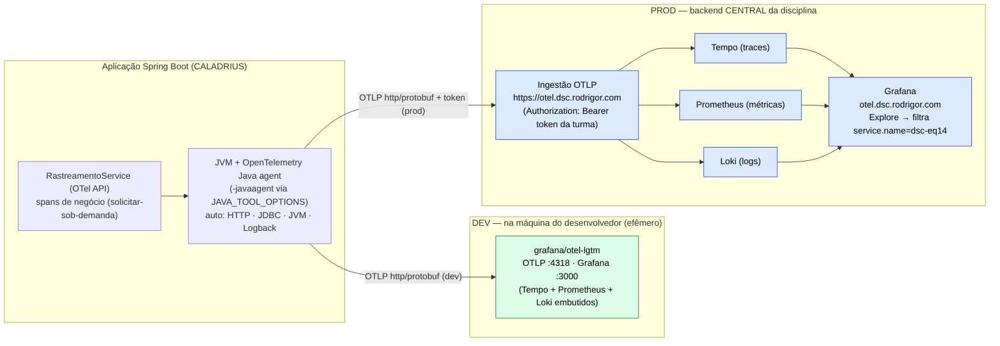

# SPEC-14 — Observabilidade com OpenTelemetry (traces, métricas e logs no stack central da disciplina)

| | |
|---|---|
| **Área** | `OBS` (observabilidade) |
| **Papéis** | SYSADMIN (variáveis de ambiente/segredos no deploy); equipe/professor (leitura do painel Grafana). **Sem papel de usuário final** — é capacidade transversal de operação. |
| **Status geral** | 🟢 **Implementada (2026-07-24)** — **dev e prod prontos** (código + infra) e **validados**: 199 testes verdes (incl. contexto Testcontainers V1→V13), `docker build -f docker/Dockerfile .` **verde** e **RN-OBS-01 conferido na imagem** (agente presente porém inerte; `ENTRYPOINT` intocado). Instrumentação = **agente Java (automática)** + **camada manual fina** (`RastreamentoService`) em **1 fluxo de negócio**. **Sem migration.** Falta apenas o passo **operacional**: preencher o `.env` do servidor (com o **token da turma**) e redeployar (§7). |
| **Constituição** | Art. I (versões fixas — agente **pinado `v2.30.0`**; deps OTel pinadas pelo BOM do Spring Boot), Art. XI (segurança — token só por env, TLS, nada de segredo no repo), **Art. XII (o gate do CI é a compilação — o download do agente no build de prod não pode quebrar `docker build`)**, Art. XIII (`/ping` e Actuator intactos), Art. XIV (reusa o **backend central**, **não sobe infra própria** no servidor compartilhado) |
| **Relacionada** | [SPEC-08](SPEC-08-login-social-google.md) (padrão de **ativação condicional por variável de ambiente** — o app sobe igual sem config), [SPEC-10](SPEC-10-integracao-whatsapp.md) (mesma filosofia "sem config, sem quebra"; infra externa via env/segredos), backlog **"Observabilidade"** do [roadmap §4](../03-tarefas-e-roadmap.md) · **ADR-17** ([plano técnico §9](../02-plano-tecnico.md)) |
| **Código/Infra** | `pom.xml` (**+`opentelemetry-api`** compile, **+`opentelemetry-sdk-testing`** test — versões geridas pelo `opentelemetry-bom` do Spring Boot, 1.43.0); `observabilidade/RastreamentoService` + `observabilidade/TelemetriaConfig`; `service/SolicitacaoViagemService` (2 spans de negócio + logs estruturados); `docker/Dockerfile` (baixa e embute o agente pinado); `docker/docker-compose.prod.yml` (`OTEL_*` + `JAVA_TOOL_OPTIONS`, todos com default vazio); `.env.example`; `docker/Dockerfile.dev` + `docker/docker-compose.dev.yml` (agente + `grafana/otel-lgtm`). **Testes**: `RastreamentoServiceTest`, `SolicitacaoViagemTelemetriaTest`. **Nenhuma migration.** |

---

## 1. A lacuna que esta spec cobre

Hoje a observabilidade do CALADRIUS se resume a dois pontos **locais ao container**: o
health-check público `/ping` (Art. XIII) e o Actuator (`health,info,metrics` — `application.yml`).
Isso só ajuda quem consegue **acessar o servidor**. O problema que o dono da infra (professor)
levantou em sala é justamente o contrário:

> *"Um problema pode gerar **indisponibilidade** e você não consegue acessar para ver o que houve."*

A ideia do **agregador central** é reunir os sinais de todas as equipes num só lugar (Grafana), de
fora do servidor, para diagnosticar mesmo quando a aplicação está fora do ar. Esta spec entrega isso:
**exportar os três sinais de telemetria** — **traces**, **métricas** e **logs** — via
**OpenTelemetry (OTLP)** para o **backend central da disciplina** (Grafana + Tempo + Prometheus +
Loki), **sem subir infra própria** e **sem migration**.

Dois princípios regem o desenho (espelham SPEC-08/10):

- **Instrumentação de baixo atrito** — um **agente Java** (instrumentação por bytecode) captura
  automaticamente HTTP (Spring MVC), JDBC (Hikari/PostgreSQL), a JVM e os **logs** (Logback), **sem
  uma linha de código**. Sobre essa base, uma **camada manual mínima** (`RastreamentoService`)
  nomeia operações do **nosso domínio** e as enriquece com atributos de negócio — o que o agente,
  sozinho, não conhece (é também o entregável avaliado de "spans manuais").
- **Ligado por configuração, desligado por padrão** — sem as variáveis `OTEL_*`/`JAVA_TOOL_OPTIONS`,
  o app sobe **idêntico ao de hoje** (agente dormente; a camada manual vira no-op). A telemetria é
  ativada no `.env` do servidor (RN-OBS-01), como o login Google (SPEC-08) e o WhatsApp (SPEC-10).

### Requisitos funcionais

| ID | Requisito | Estado |
|---|---|---|
| **FR-OBS-01** | Exportar **traces** das requisições (HTTP + JDBC) para o Tempo via OTLP. | 🟢 código+infra ✅ (aguarda `.env` do servidor) |
| **FR-OBS-02** | Exportar **métricas** (JVM, HTTP, pool de conexões) para o Prometheus via OTLP. | 🟢 código+infra ✅ (aguarda `.env`) |
| **FR-OBS-03** | Exportar **logs** da aplicação para o **Loki** via OTLP (agregador central), correlacionados ao trace. | 🟢 código+infra ✅ (aguarda `.env`) |
| **FR-OBS-04** | Separar a telemetria da equipe por `service.name = dsc-eq14` (filtro no Grafana). | 🟢 ✅ (`dsc-eq14` prod / `dsc-eq14-dev` dev) |
| **FR-OBS-05** | Não exigir migration; ligar/desligar por variável de ambiente. | ✅ (por desenho) |
| **FR-OBS-06** | **Spans de negócio** manuais (nome de operação + atributos de domínio), cobertos por teste. | ✅ 2 fluxos: `solicitar-sob-demanda` + `aprovar-solicitacao` (ver §3.1/§8) |

---

## 2. Decisão de instrumentação — base da **ADR-17**

**Decisão:** **agente OpenTelemetry Java standalone** para os três sinais automáticos, **complementado
por uma camada manual mínima** (`RastreamentoService`) para spans de negócio, exportando **OTLP** para
o **backend central da disciplina** (logs no Loki pela mesma via OTLP). Ativação **condicional** por
variável de ambiente. Registrada como **ADR-17** no plano técnico.

### 2.1 Como instrumentar — agente (auto) + camada manual mínima

| Aspecto | **Agente OTel Java (auto)** — base | **Camada manual (`RastreamentoService`, OTel API)** — complemento |
|---|---|---|
| **O que cobre** | HTTP (Spring MVC), JDBC, JVM, **logs (Logback)**, cliente HTTP — "de graça". | Operações de **negócio** nomeadas (ex.: `solicitar-sob-demanda`) + atributos de domínio (destino, tipo). |
| **Mudança de código** | **Nenhuma** — anexado por `-javaagent`. | Mínima e **aditiva**: só a **API** no `pom.xml` (SDK vem do agente) + 1 fluxo fiado. |
| **Testabilidade** | Não testável em unidade (bytecode; exige o agente na JVM). | **Testável** com `opentelemetry-sdk-testing` (spans em memória) — ver §8. |
| **Desligar sem config** | Trivial — sem `JAVA_TOOL_OPTIONS`, a JVM nem carrega o agente. | `GlobalOpenTelemetry.get()` vira **no-op**: a ação roda, o span é descartado (RN-OBS-06). |

**Por quê os dois:** o agente entrega os três sinais **operacionais** (ver o que acontece em prod)
sem uma linha de código e sai de cena quando não configurado — o padrão "sem config, sem quebra" das
SPEC-08/10. A **camada manual** existe por dois motivos: (1) é o **entregável avaliado** ("≥2 spans
manuais + atributo de negócio + log estruturado"); (2) só ela dá um alvo **testável em unidade** e um
**cenário real** ("solicitou → gerou telemetria"). Métricas/spans de negócio adicionais ficam para
depois (§3.2), via Micrometer/OTel SDK.

### 2.2 Onde mandar — backend central da disciplina × self-host

| Aspecto | **Backend central (Grafana+Tempo+Prometheus+Loki da disciplina)** — escolhido | **Self-host (subir `otel-lgtm`/collector no servidor da equipe)** |
|---|---|---|
| **Infra da equipe** | **Zero** — o professor provê e mantém. | Container(es) pesado(s) na VPS **compartilhada** (RAM, portas, TLS). |
| **Art. XIV (ambiente compartilhado)** | Respeitado — nada de recursos extras no servidor. | Tensiona: `grafana/otel-lgtm` é pesado; portas 3000/4317/4318 podem colidir; expor Grafana é risco. |
| **Segredo** | Um **token da turma** no header `Authorization` (por env). | Gerir auth/HTTPS do próprio Grafana. |
| **Separação entre equipes** | Por `OTEL_SERVICE_NAME` (`dsc-eq14`). | N/A (isolado). |

**Por quê o central:** é o mesmo princípio do Postgres/pgAdmin **compartilhados** — reusar a infra da
disciplina em vez de duplicá-la (Art. XIV). O `grafana/otel-lgtm` **continua existindo, mas só no
`docker-compose.dev.yml`** (roda na máquina do desenvolvedor, isolado, **sem token**, sem poluir o
backend compartilhado com ruído de dev — ver §4.1).

### 2.3 Logs — OTLP na mesma via × appender Loki dedicado

**Decisão: logs pela mesma via OTLP** (não um `loki-logback-appender` nem push direto ao Loki).
O mesmo endpoint OTLP (`https://otel.dsc.rodrigor.com`) roteia **traces→Tempo**,
**métricas→Prometheus** e **logs→Loki**. Vantagens: **correlação log↔trace** (cada log carrega
`trace_id`/`span_id` que o agente injeta no MDC), **reuso** do mesmo agente/endpoint/token, e **zero
dependência nova** de runtime além da API. Confirmado no guia do professor
([`docs/opentelemetry-logs.md`](../../opentelemetry-logs.md)): o agente Java intercepta o Logback e
envia ao OTLP **sem código**.

---

## 3. Escopo

### 3.1 Inclui (implementado)

**Aplicação (Java):**
- **Deps** (`pom.xml`, aditivas e **versionless** — geridas pelo `opentelemetry-bom` do Spring Boot,
  1.43.0): `io.opentelemetry:opentelemetry-api` (compile) e `io.opentelemetry:opentelemetry-sdk-testing`
  (test). O **SDK/exportador OTLP não entram no jar** — vêm do **agente** em runtime.
- **`observabilidade/RastreamentoService`**: fina camada sobre a API OTel. `rastrear(nome, atributos,
  acao)` abre um span, anexa atributos, e em falha grava a exceção + marca `ERROR` sem engolir o erro.
- **`observabilidade/TelemetriaConfig`**: bean `OpenTelemetry` = `GlobalOpenTelemetry.get()`
  (`@ConditionalOnMissingBean`) — com agente, é a instância dele; sem agente, no-op.
- **2 fluxos de negócio fiados** (`SolicitacaoViagemService`), cada um com **log estruturado** (vai ao
  Loki correlacionado ao trace) e atributos **sem PII** (RN-OBS-08):
  - `solicitarSobDemanda` → span **`solicitar-sob-demanda`** (`solicitacao.tipo`, `solicitacao.cidade_destino`);
  - `aprovar` → span **`aprovar-solicitacao`** (`solicitacao.id`, `solicitacao.cidade_destino`).

**Dev** (`docker/Dockerfile.dev` + `docker/docker-compose.dev.yml`):
- `Dockerfile.dev` baixa o `opentelemetry-javaagent.jar` **pinado** (`ARG OTEL_AGENT_VERSION=2.30.0`) e
  o injeta no `mvn spring-boot:run` (`-javaagent:/app/opentelemetry-javaagent.jar`).
- `docker-compose.dev.yml` sobe o serviço **`otel-lgtm`** (`grafana/otel-lgtm`: Grafana `:3000`,
  OTLP gRPC `:4317`, OTLP HTTP `:4318`) e aponta o app via `OTEL_*`
  (`OTEL_EXPORTER_OTLP_ENDPOINT=http://otel-lgtm:4318`, `http/protobuf`, exporters `otlp` para
  traces/metrics/logs, `OTEL_SERVICE_NAME=dsc-eq14-dev`, `deployment.environment=dev`).

**Prod** (`docker/Dockerfile`, `docker/docker-compose.prod.yml`, `.env.example`):
- **`docker/Dockerfile`:** baixa o agente **no estágio de build** (`maven:3.9.9-eclipse-temurin-21` tem
  `curl`), com **versão pinada** (`ARG OTEL_AGENT_VERSION=2.30.0`, `curl -fsSL`), e **copia** o `.jar`
  para o runtime com `chown mercado:mercado`. **O `ENTRYPOINT` não muda**: a ativação é **opcional**
  via `JAVA_TOOL_OPTIONS`.
- **`docker/docker-compose.prod.yml`:** repassa `OTEL_SERVICE_NAME`, `OTEL_EXPORTER_OTLP_ENDPOINT`,
  `OTEL_EXPORTER_OTLP_PROTOCOL`, `OTEL_EXPORTER_OTLP_HEADERS`, `OTEL_RESOURCE_ATTRIBUTES`,
  `OTEL_LOGS_EXPORTER` e `JAVA_TOOL_OPTIONS` — **todos com default vazio/seguro** (comportamento atual
  preservado — RN-OBS-01), lidos do `.env`.
- **`.env.example`:** documenta as chaves com **placeholder** (o token real é segredo — RN-OBS-02).

**Comum:** três sinais por OTLP (traces→Tempo, métricas→Prometheus, logs→Loki); separação por
`OTEL_SERVICE_NAME`; ambiente por `OTEL_RESOURCE_ATTRIBUTES=deployment.environment=prod|dev`.

### 3.2 Não inclui (futuro)
- **Mais fluxos manuais** além dos 2 fiados (ex.: `ViagemService.designar`, onboarding do bot) — a base
  (`RastreamentoService`) já permite adicionar em 1 linha.
- **Métricas de negócio** custom via Micrometer (ex.: solicitações/dia, taxa de aprovação).
- **Alertas** (Grafana Alerting/Alertmanager) e **dashboards custom** no backend central — são do
  professor (não controlamos aquela infra).
- **Self-host** de qualquer parte do stack no servidor da disciplina (Art. XIV — ver §2.2).

---

## 4. Arquitetura

### 4.1 Visão geral (dev × prod)

O **mesmo agente** e o **mesmo protocolo** (OTLP/http-protobuf) nos dois ambientes; muda só **o
destino** (e, em prod, o header com o token). No dev, o backend é local e efêmero; em prod, é o
central da disciplina.

### 4.2 Como o agente é ativado (sem tocar no `ENTRYPOINT`)

O `ENTRYPOINT` de prod (`java -XX:... -jar app.jar`) **não muda**. A JVM lê automaticamente a
variável **`JAVA_TOOL_OPTIONS`** e antepõe suas opções. Assim:

- `JAVA_TOOL_OPTIONS` **vazia** (default) → a JVM sobe **sem** o agente → **idêntico ao de hoje**
  (conferido na imagem: o `ENTRYPOINT` não referencia o agente e nenhuma `OTEL_*` é embutida).
- `JAVA_TOOL_OPTIONS=-javaagent:/app/opentelemetry-javaagent.jar` (definida no `.env` do servidor) →
  o agente carrega e passa a exportar, lendo as demais `OTEL_*` do ambiente. O agente também popula o
  `GlobalOpenTelemetry`, então os **spans manuais** entram no **mesmo trace**.

O `.jar` do agente **está presente na imagem** desde o build, mas fica **inerte** até o
`JAVA_TOOL_OPTIONS` referenciá-lo. É o liga/desliga sem rebuild (mesma ergonomia do `GOOGLE_CLIENT_ID`
da SPEC-08).

---

## 5. Configuração (a "modelagem" desta spec)

Esta spec **não tem schema nem migration** — a sua "modelagem" é o **conjunto de variáveis de
ambiente**. O agente OTel lê os padrões `OTEL_*` diretamente do ambiente.

| Variável | Uso | Valor DEV | Valor PROD | Segredo? |
|---|---|---|---|---|
| `OTEL_SERVICE_NAME` | Identidade/separação no Grafana | `dsc-eq14-dev` | **`dsc-eq14`** | não |
| `OTEL_EXPORTER_OTLP_ENDPOINT` | Base OTLP (o agente anexa `/v1/traces\|metrics\|logs`) | `http://otel-lgtm:4318` | `https://otel.dsc.rodrigor.com` | não |
| `OTEL_EXPORTER_OTLP_PROTOCOL` | Transporte OTLP | `http/protobuf` | `http/protobuf` | não |
| `OTEL_EXPORTER_OTLP_HEADERS` | Autenticação na ingestão | *(vazio)* | `Authorization=Bearer <token da turma>` | **SIM** |
| `OTEL_RESOURCE_ATTRIBUTES` | Atributos de recurso (ambiente) | `deployment.environment=dev` | `deployment.environment=prod` | não |
| `OTEL_LOGS_EXPORTER` | Habilita export de **logs** (→ Loki) | `otlp` | `otlp` *(explícito — garante Loki)* | não |
| `OTEL_TRACES_EXPORTER` / `OTEL_METRICS_EXPORTER` | Traces/métricas | `otlp` | `otlp` *(default do agente v2.x)* | não |
| `JAVA_TOOL_OPTIONS` | **Liga o agente** na JVM | *(injetado no `CMD` do dev)* | `-javaagent:/app/opentelemetry-javaagent.jar` | não |

> **Detalhe do endpoint:** usa-se a **base** (sem `/v1/...`); o agente monta o caminho por sinal.
> **`http/protobuf`** casa com a porta 4318/HTTPS (gRPC seria 4317).
>
> **Detalhe do header:** no `.env`, **não** envolver o valor em aspas — o Compose lê literal e as
> aspas virariam parte do header (→ 401). Formato: `OTEL_EXPORTER_OTLP_HEADERS=Authorization=Bearer eyJ...`.

---

## 6. Regras de negócio / operacionais

| Regra | Descrição |
|---|---|
| **RN-OBS-01** | **Sem configuração, sem quebra**: ausentes as variáveis (em especial `JAVA_TOOL_OPTIONS`), o app sobe **idêntico ao atual** — a JVM nem carrega o agente e a camada manual vira no-op. **Conferido na imagem** (§4.2/§8). Espelha a RN-WPP-02 (SPEC-10) e o padrão da SPEC-08. |
| **RN-OBS-02** | **O token da turma é SEGREDO**: vive **só** no `.env` do servidor (`/home/ghactions/eq14/.env`), **nunca** no repositório (que é público). O `.env.example` leva apenas *placeholder*. Erro **401** na ingestão = token ausente/errado no header (Art. XI). |
| **RN-OBS-03** | **O gate do CI não pode quebrar** (Art. XII): o agente é baixado com **versão pinada** (Art. I) e o `docker build -f docker/Dockerfile .` segue **verde** (validado). O download usa `curl -fsSL` (falha o build em erro HTTP em vez de gerar um `.jar` corrompido). |
| **RN-OBS-04** | **Separação por `OTEL_SERVICE_NAME`**: exatamente **`dsc-eq14`** em prod (convenção do professor — é o filtro no Grafana → Explore); `dsc-eq14-dev` no dev (destino local, não polui o central). Ambientes distinguidos por `deployment.environment`. |
| **RN-OBS-05** | **Não sobe infra no servidor compartilhado** (Art. XIV): usa o backend central. O `grafana/otel-lgtm` roda **só no dev**, na máquina do desenvolvedor, e some com `docker compose down`. |
| **RN-OBS-06** | **Telemetria nunca derruba o app**: o agente é resiliente (endpoint fora → registra o erro e segue); a camada manual, sem agente, opera como **no-op** e **repropaga** exceções de negócio sem alterá-las (coberto por teste). Espelha RN-WPP-01. |
| **RN-OBS-07** | **Retenção é limitada** (backend central): **traces 72 h**, **logs 48 h**, **métricas 7 dias**. É diagnóstico operacional, não histórico de longo prazo. |
| **RN-OBS-08** | **Nada de segredo/PII na telemetria**: atributos e logs de negócio não carregam senha, token nem dado sensível (o span `solicitar-sob-demanda` leva só `tipo` e `cidade_destino`). Em prod, root `WARN`/app `INFO` já limita o volume. |

---

## 7. Deploy e operação

- **Onde as variáveis vivem:** no `.env` do servidor, gerido pelas **mesmas mãos** que já definem
  `DATABASE_PASSWORD`/`GOOGLE_CLIENT_ID` (SYSADMIN/deploy). `.env` está no `.gitignore`.
- **Sequência de ativação (prod):**
  1. **Já feito neste incremento:** Dockerfile embute o agente; compose repassa as env (default vazio);
     app com a camada manual. O `push` faz o CI (`deploy.yml`) buildar a imagem (com o agente) e publicar.
  2. Definir as chaves no `.env` do servidor (inclui o **token** — RN-OBS-02). Bloco pronto para
     copiar em [`.env.example`](../../../.env.example).
  3. Redeploy → o container sobe com `JAVA_TOOL_OPTIONS` apontando o agente.
  4. Validar no Grafana (§8).
- **⚠️ O push dispara o deploy.** Como o `docker/Dockerfile` mudou (embute o agente), o próximo deploy
  **rebuilda a imagem com o agente**. Sem o `.env`, o comportamento em runtime é **idêntico** (agente
  inerte — RN-OBS-01): é seguro. A telemetria só flui quando o `.env` do servidor for preenchido.
- **Ponto a confirmar:** se o servidor usa o `docker-compose.prod.yml` **do repositório** (então as
  novas chaves de `environment` sobem no próximo deploy) ou uma **cópia estática** em
  `/home/ghactions/eq14/` (aí é preciso atualizar a cópia à mão). O `.env` é sempre manual.

---

## 8. Verificação

Diferente das specs de infra "pura", aqui **há testes automatizados** (a camada manual é código de
domínio), somados à validação operacional do agente/infra.

**Testes automatizados** (`mvn test` — 199 verdes, incl. contexto Testcontainers V1→V13):
- **`RastreamentoServiceTest`** (unidade, a *ferramenta*, sem agente/rede — usa `opentelemetry-sdk-testing`
  com `InMemorySpanExporter`): (a) caminho feliz cria span com nome+atributo e devolve o resultado;
  (b) exceção → span `ERROR` + evento `exception`, repropagada; (c) **sem agente** (`OpenTelemetry.noop()`)
  executa a ação e **não quebra** (RN-OBS-06).
- **`SolicitacaoViagemTelemetriaTest`** (*cenário real*, 4 casos): dirige os métodos de negócio de
  verdade (repos mockados) com um `RastreamentoService` real ligado ao SDK de teste, verificando os
  **dois** spans: **`solicitar-sob-demanda`** (nasce com `cidade_destino`/`tipo`; duplicata → `ERROR`)
  e **`aprovar-solicitacao`** (nasce com `cidade_destino`; aprovar não-pendente → `ERROR`) — FR-OBS-06.

**Validação de build/infra:**
- **Gate do CI (Art. XII):** `docker build -f docker/Dockerfile .` **verde** — confirma que o download
  do agente pinado funciona e a imagem monta (validado).
- **RN-OBS-01 (regressão):** conferido na imagem que o `ENTRYPOINT` **não** referencia o agente e que
  **nenhuma** `OTEL_*`/`JAVA_TOOL_OPTIONS` é embutida — sem `.env`, o app sobe idêntico.

**Validação operacional (no deploy, pós-`.env`):** no **Grafana → Explore**, filtrando
`service.name = dsc-eq14`:
- **Tempo** mostra **traces** de requisições, com o span de negócio **`solicitar-sob-demanda`**
  aninhado no trace HTTP quando um passageiro solicita sob demanda;
- **Prometheus** mostra **métricas** JVM/HTTP/pool;
- **Loki** mostra os **logs** da aplicação (`{service_name="dsc-eq14"}`), e um log traz
  `trace_id`/`span_id` clicável até o trace (correlação log↔trace — FR-OBS-03).
- **Diagnóstico rápido:** **401** na ingestão → token (RN-OBS-02); **sem dados** → conferir endpoint
  (base **sem** `/v1`), protocolo `http/protobuf` e o `OTEL_SERVICE_NAME`.
- **Dev:** o mesmo, apontando para o `otel-lgtm` local em `http://localhost:3000`.

---

## 9. Impacto em specs/documentos existentes

- **[Roadmap §1](../03-tarefas-e-roadmap.md)** — nova capacidade **"Observabilidade (OpenTelemetry)"**
  (🟢 código+infra prontos; aguarda `.env`) + **Incremento E**.
- **[Roadmap §4](../03-tarefas-e-roadmap.md)** — o item transversal **"Observabilidade"** ("avaliar
  métricas/health além de `/ping`") passa a ser **endereçado por esta spec**.
- **[Plano técnico §9](../02-plano-tecnico.md)** — **ADR-17** registrada (agente auto + camada manual +
  backend central + logs OTLP).
- **[CLAUDE.md](../../../CLAUDE.md)** — marco e novas env registrados no "Estado atual"; novo pacote
  `observabilidade/`.
- **Sem migration** — esta spec **quebra de propósito** o padrão das últimas (V8→V13): é infra/config +
  uma camada de código fina, não altera o schema (Art. IV/V permanecem intactos).

---

## 10. Próximos passos

1. **Preencher o `.env`** do servidor (bloco pronto no `.env.example`) com o **token da turma** e
   redeployar; **validar no Grafana** (traces/métricas/logs + o span `solicitar-sob-demanda`,
   filtrando `dsc-eq14` — §8).
2. **(Futuro)** mais **spans de negócio** (ex.: `ViagemService.designar`, onboarding do bot) reusando o
   `RastreamentoService`; **métricas de negócio** via Micrometer/OTel SDK; correlação da telemetria com
   a auditoria (`log_auditoria`) e com o WhatsApp (SPEC-10).

> **Nota sobre o agente pinado:** a versão fixada (`v2.30.0`, embute o SDK OTel 1.64.0) segue o Art. I.
> Atualizações do agente são uma mudança **consciente** (bump do `ARG OTEL_AGENT_VERSION` no
> Dockerfile), nunca um `latest` que possa quebrar o build de prod sem aviso. A **API** OTel usada pela
> app (1.43.0, do BOM do Spring Boot) é ≤ à do agente — compatível.
